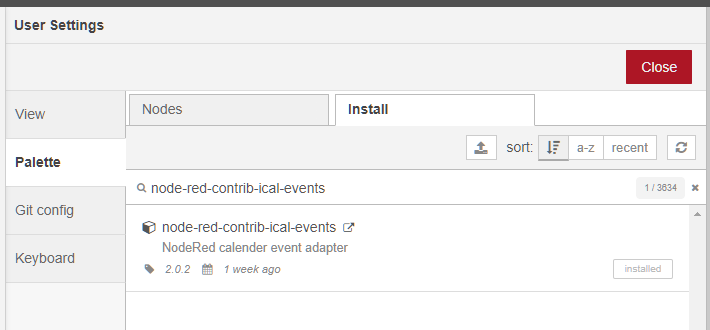

# Overview

This Node module gets the events from an ical-URL, a caldav-server or from iCloud.

## Usage as Node-RED nodes

First of all install [Node-RED](http://nodered.org/docs/getting-started/installation)

### Install node-red-contrib-ical-events

#### Node-RED palette manager

  

There are three types of nodes:
- [upcoming](./upcoming.md) - a list of events
- [sensors](./sensors.md) - check if a event is running currently
- [trigger](./trigger.md) - trigger a output on event start and event end  

## Usage as cli

``` 
installed via npm globally: npm i -g kalender-events-cli
alternatively: npx kalender-events-cli@latest
```

```
Usage: kalender-events [options] [command]

Options:
  -u, --url [url]                          URL to Calendar
  -t, --type, --calenderType [type]        Type can be ical, icloud or caldav
  --pastview [pastview]
  --pastview-units [pastviewUnits]
  --preview [preview]
  --preview-units [previewUnits]
  --filter [filter]
  --filter-property [filterProperty]
  --filter-operator [filterOperator]
  --trigger [trigger]
  --now [now]
  --username [username]
  --password [password]
  --includeTodo
  --replaceDates, --replacedates
  --language [language]
  --eventTypes, --eventtypes [eventtypes]
  --basicAuth [basicAuth]
  -h, --help                               display help for command

Commands:
  upcoming                                 A list of events
  trigger                                  Trigger a output on event start and event end
  sensors                                  Check if a event is running currently
  icloudurl                                Get iCloud Calenders and URL
  help [command]                           display help for command
```

## Usage in your own node module

```sh
$ npm install kalender-events
```

```ts
//Typescript - index.ts

import { KalenderEvents } from "kalender-events";

const ev = new KalenderEvents({
    url: "https://calendar.google.com/calendar/ical/xxx%40group.calendar.google.com/private-xxx/basic.ics"
});

ev.getEvents({
    type: 'ical',
    preview: 10,
    previewUnits:'days',
    pastview: 10,
    pastviewUnits:'days'
}).then(data => {
    console.log(data);
})
```

or

```js
//Javascript - index.js

var kalender_events = require("kalender-events");
var ev = new kalender_events.KalenderEvents({
    url: "https://calendar.google.com/calendar/ical/xxx%40group.calendar.google.com/private-xxx/basic.ics"
});

ev.getEvents({
    type: 'ical',
    preview: 10,
    previewUnits: 'days',
    pastview: 10,
    pastviewUnits: 'days'
}).then(function (data) {
    console.log(data);
});
```

output:  
```sh
$ tsc index.ts
$ node .\index.js
[
  {
    date: '02.05.2020 10:00',
    event: 'test',
    summary: 'test',
    topic: 'test',
    calendarName: undefined,
    eventStart: 2020-05-02T07:00:00.000Z,
    eventEnd: 2020-05-02T08:00:00.000Z,
    description: '',
    id: '123@google.com',
    allDay: false,
    rule: ' ',
    location: '',
    countdown: { days: -1, hours: -7, minutes: -26, seconds: -38 }
  }
]
```