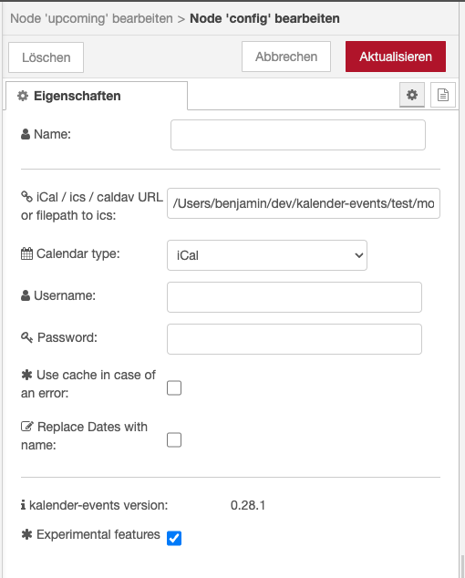

# Experimental Features

at the bottom of the config node, you can enable some `experimental features`.

This features currently are:

- worker threads in order to hopefully fix [#128](https://github.com/naimo84/node-red-contrib-ical-events/issues/128) and [#163](https://github.com/naimo84/node-red-contrib-ical-events/issues/163)

---

  