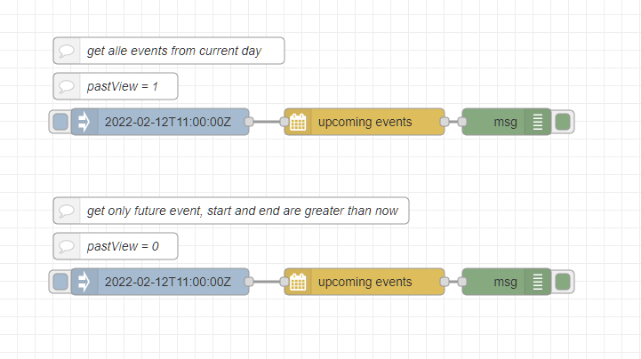
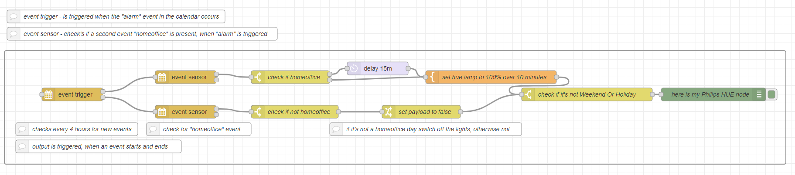
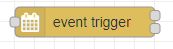

# Node-RED

## Only handle events not started aka future events



### _flow description_

The first flow get all events from the currect day by setting pastview = **1** and preview = 1.  
The seconds only gets future events by setting pastview = **0** and preview = 1.

### _flow json_

```json
[{"id":"eae57d2f08fb1acc","type":"tab","label":"Samples","disabled":false,"info":"","env":[]},{"id":"327b4733891113ca","type":"ical-upcoming","z":"eae57d2f08fb1acc","confignode":"feadad7e6f14505e","timeout":"","timeoutUnits":"seconds","cron":"","name":"","offsettype":"","offset":"","offsetUnitstype":"","offsetUnits":"","eventtypes":"events","eventtypestype":"eventtypes","calendar":"","calendartype":"str","triggertype":"trigger","trigger":"always","timezone":"","timezonetype":"str","dateformat":"{ \"timeStyle\": \"short\", \"dateStyle\": \"short\" }","dateformattype":"json","language":"en","languagetype":"language","filterProperty":"summary","filterPropertytype":"filterProperty","filterOperator":"between","filterOperatortype":"filterOperator","filtertype":"str","filter2type":"str","filter2":"","filter":"","checkall":false,"endpreview":"","endpreviewUnits":"","previewtype":"num","preview":"1","previewUnitstype":"previewUnits","previewUnits":"days","pastviewtype":"num","pastview":"0","pastviewUnits":"days","pastviewUnitstype":"pastviewUnits","x":470,"y":340,"wires":[["3ccec61b3df60a7a"]]},{"id":"049c0f8430c9660e","type":"inject","z":"eae57d2f08fb1acc","name":"","props":[{"p":"payload"},{"p":"topic","vt":"str"}],"repeat":"","crontab":"","once":false,"onceDelay":0.1,"topic":"","payload":"2022-02-12T11:00:00Z","payloadType":"str","x":240,"y":340,"wires":[["327b4733891113ca"]]},{"id":"3ccec61b3df60a7a","type":"debug","z":"eae57d2f08fb1acc","name":"","active":true,"tosidebar":true,"console":false,"tostatus":false,"complete":"true","targetType":"full","statusVal":"","statusType":"auto","x":630,"y":340,"wires":[]},{"id":"da5e95e321387edf","type":"comment","z":"eae57d2f08fb1acc","name":"get only future event, start and end are greater than now","info":"","x":320,"y":260,"wires":[]},{"id":"07ce1eef030cc17a","type":"ical-upcoming","z":"eae57d2f08fb1acc","confignode":"feadad7e6f14505e","timeout":"","timeoutUnits":"seconds","cron":"","name":"","offsettype":"","offset":"","offsetUnitstype":"","offsetUnits":"","eventtypes":"events","eventtypestype":"eventtypes","calendar":"","calendartype":"str","triggertype":"trigger","trigger":"always","timezone":"","timezonetype":"str","dateformat":"{ \"timeStyle\": \"short\", \"dateStyle\": \"short\" }","dateformattype":"json","language":"en","languagetype":"language","filterProperty":"summary","filterPropertytype":"filterProperty","filterOperator":"between","filterOperatortype":"filterOperator","filtertype":"str","filter2type":"str","filter2":"","filter":"","checkall":false,"endpreview":"","endpreviewUnits":"","previewtype":"num","preview":"1","previewUnitstype":"previewUnits","previewUnits":"days","pastviewtype":"num","pastview":"1","pastviewUnits":"days","pastviewUnitstype":"pastviewUnits","x":470,"y":160,"wires":[["90954ff9e10f0989"]]},{"id":"c09324da7188d996","type":"inject","z":"eae57d2f08fb1acc","name":"","props":[{"p":"payload"},{"p":"topic","vt":"str"}],"repeat":"","crontab":"","once":false,"onceDelay":0.1,"topic":"","payload":"2022-02-12T11:00:00Z","payloadType":"str","x":240,"y":160,"wires":[["07ce1eef030cc17a"]]},{"id":"90954ff9e10f0989","type":"debug","z":"eae57d2f08fb1acc","name":"","active":true,"tosidebar":true,"console":false,"tostatus":false,"complete":"true","targetType":"full","statusVal":"","statusType":"auto","x":630,"y":160,"wires":[]},{"id":"279f36a8e374ce6e","type":"comment","z":"eae57d2f08fb1acc","name":"get alle events from current day","info":"","x":250,"y":80,"wires":[]},{"id":"1af07a3099f95be4","type":"comment","z":"eae57d2f08fb1acc","name":"pastView = 0","info":"","x":190,"y":300,"wires":[]},{"id":"9573b4f5a65070d1","type":"comment","z":"eae57d2f08fb1acc","name":"pastView = 1","info":"","x":190,"y":120,"wires":[]},{"id":"feadad7e6f14505e","type":"ical-config","url":"https://naimo84.github.io/kalender-events/test.ics","caldav":"","caltype":"ical","name":"naimo84.github.io","replacedates":false,"usecache":false,"username":"","password":"","calendar":"","pastWeeks":"0","futureWeeks":"4"}]
```


## HomeWorking daily alarm in the morning

Define two events in the calendar, one for HomeWorking days (allday event at MON,TUE,WED,FRI) and one the the alarm (event from 05:50 to 06:30 at MON,TUE,WED,THU,FRI).
So thursday is not a HomeWorking day ;)

```
BEGIN:VEVENT
DTSTART;VALUE=DATE:20211105
DTEND;VALUE=DATE:20211106
RRULE:FREQ=WEEKLY;WKST=MO;BYDAY=FR,MO,TU,WE
DTSTAMP:20220205T113246Z
UID:homeoffice-uuid
CREATED:20211105T114802Z
DESCRIPTION:
LAST-MODIFIED:20211117T094702Z
LOCATION:
SEQUENCE:2
STATUS:CONFIRMED
SUMMARY:homeoffice
TRANSP:TRANSPARENT
END:VEVENT
```
```
BEGIN:VEVENT
DTSTART;TZID=Europe/Berlin:20200121T055000
DTEND;TZID=Europe/Berlin:20200121T063000
RRULE:FREQ=WEEKLY;BYDAY=FR,MO,TH,TU,WE
DTSTAMP:20220205T113246Z
UID:alarm-uuid
CREATED:20200120T170922Z
DESCRIPTION:
LAST-MODIFIED:20200124T181506Z
LOCATION:
SEQUENCE:1
STATUS:CONFIRMED
SUMMARY:alarm
TRANSP:TRANSPARENT
END:VEVENT
```



### _flow description_

place a , which gets triggered when the alarm event occurs. In this example the start output at 05:50 and the end at 06:30.

place two , which check on start and end if it's a HomeWorking day. 

**If it is a HomeWorking day:**

delay the wakeup light for 15 minutes and don't switch it off on the end events.

**If it's not a HomeWorking day:**

switch on the wakeup light instant on eventStart at 05:50 and switch it off on eventEnd at 06:30

---

### _flow json_

```json
[{"id":"449ac5d34f0c17e8","type":"tab","label":"Homeoffice","disabled":false,"info":"","env":[]},{"id":"4f79424fc04dbb0b","type":"group","z":"449ac5d34f0c17e8","style":{"stroke":"#999999","stroke-opacity":"1","fill":"none","fill-opacity":"1","label":true,"label-position":"nw","color":"#a4a4a4"},"nodes":["b87ace3b.14223","ec966f1b.74f","7617c7bb.238228","be97b055.2c3db","bfdda842.f81eb8","2b3f38db.c45788","4f63066f.a19028","fb00c8dd.551488","5ea1f718.7b9218","e3afd8bc3348742b","4bbfc3f1fdf28a46","bf1511d6199faf1e","e7c5cd49205cf71e","664a587a316794af"],"x":14,"y":139,"w":1792,"h":262},{"id":"b87ace3b.14223","type":"switch","z":"449ac5d34f0c17e8","g":"4f79424fc04dbb0b","name":"check if homeoffice","property":"payload.on","propertyType":"msg","rules":[{"t":"true"},{"t":"false"}],"checkall":"true","repair":false,"outputs":2,"x":670,"y":200,"wires":[["7617c7bb.238228"],["be97b055.2c3db"]]},{"id":"ec966f1b.74f","type":"ical-sensor","z":"449ac5d34f0c17e8","g":"4f79424fc04dbb0b","confignode":"feadad7e6f14505e","timeout":"","timeoutUnits":"seconds","cron":"","name":"","offsettype":"","offset":"","offsetUnitstype":"","offsetUnits":"","eventtypes":"events","eventtypestype":"eventtypes","calendar":"","calendartype":"str","triggertype":"trigger","trigger":"match","timezone":"","timezonetype":"str","dateformat":"{ \"timeStyle\": \"short\", \"dateStyle\": \"short\" }","dateformattype":"json","language":"en","languagetype":"language","filterProperty":"summary","filterPropertytype":"filterProperty","filterOperator":"between","filterOperatortype":"filterOperator","filtertype":"str","filter2type":"str","filter2":"","filter":"homeoffice","combineResponse":false,"x":430,"y":200,"wires":[["b87ace3b.14223"],[]]},{"id":"7617c7bb.238228","type":"delay","z":"449ac5d34f0c17e8","g":"4f79424fc04dbb0b","name":"","pauseType":"delay","timeout":"15","timeoutUnits":"minutes","rate":"1","nbRateUnits":"1","rateUnits":"second","randomFirst":"1","randomLast":"5","randomUnits":"seconds","drop":false,"allowrate":false,"outputs":1,"x":870,"y":180,"wires":[["be97b055.2c3db"]]},{"id":"be97b055.2c3db","type":"template","z":"449ac5d34f0c17e8","g":"4f79424fc04dbb0b","name":"set hue lamp to 100% over 10 minutes","field":"payload","fieldType":"msg","format":"json","syntax":"mustache","template":"{\n \"brightness\":100,\n \"transitionTime\": 600\n}","output":"json","x":1130,"y":200,"wires":[["2b3f38db.c45788"]]},{"id":"bfdda842.f81eb8","type":"ical-events","z":"449ac5d34f0c17e8","g":"4f79424fc04dbb0b","confignode":"feadad7e6f14505e","timeout":"4","timeoutUnits":"hours","cron":"","name":"","offsettype":"num","offset":"","offsetUnitstype":"offsetUnits","offsetUnits":"minutes","eventtypes":"events","eventtypestype":"eventtypes","calendar":"","calendartype":"str","triggertype":"trigger","trigger":"match","timezone":"","timezonetype":"str","dateformat":"{ \"timeStyle\": \"short\", \"dateStyle\": \"short\" }","dateformattype":"json","language":"en","languagetype":"language","filterProperty":"summary","filterPropertytype":"filterProperty","filterOperator":"between","filterOperatortype":"filterOperator","filtertype":"str","filter2type":"str","filter2":"","filter":".*alarm.*","x":170,"y":240,"wires":[["ec966f1b.74f"],["4f63066f.a19028"]]},{"id":"2b3f38db.c45788","type":"switch","z":"449ac5d34f0c17e8","g":"4f79424fc04dbb0b","name":"check if it's not Weekend Or Holiday","property":"day-info.today.isWeekendOrHoliday","propertyType":"global","rules":[{"t":"false"}],"checkall":"true","repair":false,"outputs":1,"x":1350,"y":240,"wires":[["4bbfc3f1fdf28a46"]]},{"id":"4f63066f.a19028","type":"ical-sensor","z":"449ac5d34f0c17e8","g":"4f79424fc04dbb0b","confignode":"feadad7e6f14505e","timeout":"","timeoutUnits":"seconds","cron":"","name":"","offsettype":"","offset":"","offsetUnitstype":"","offsetUnits":"","eventtypes":"events","eventtypestype":"eventtypes","calendar":"","calendartype":"str","triggertype":"trigger","trigger":"match","timezone":"","timezonetype":"str","dateformat":"{ \"timeStyle\": \"short\", \"dateStyle\": \"short\" }","dateformattype":"json","language":"en","languagetype":"language","filterProperty":"summary","filterPropertytype":"filterProperty","filterOperator":"between","filterOperatortype":"filterOperator","filtertype":"str","filter2type":"str","filter2":"","filter":"homeoffice","combineResponse":false,"x":430,"y":280,"wires":[["5ea1f718.7b9218"],[]]},{"id":"fb00c8dd.551488","type":"change","z":"449ac5d34f0c17e8","g":"4f79424fc04dbb0b","name":"set payload to false","rules":[{"t":"set","p":"payload","pt":"msg","to":"false","tot":"bool"}],"action":"","property":"","from":"","to":"","reg":false,"x":970,"y":280,"wires":[["2b3f38db.c45788"]]},{"id":"5ea1f718.7b9218","type":"switch","z":"449ac5d34f0c17e8","g":"4f79424fc04dbb0b","name":"check if not homeoffice","property":"payload.on","propertyType":"msg","rules":[{"t":"false"}],"checkall":"true","repair":false,"outputs":1,"x":680,"y":280,"wires":[["fb00c8dd.551488"]]},{"id":"e3afd8bc3348742b","type":"comment","z":"449ac5d34f0c17e8","g":"4f79424fc04dbb0b","name":"if it's not a homeoffice day switch off the lights, otherwise not","info":"","x":980,"y":320,"wires":[]},{"id":"4bbfc3f1fdf28a46","type":"debug","z":"449ac5d34f0c17e8","g":"4f79424fc04dbb0b","name":"here is my Philips HUE node","active":true,"tosidebar":true,"console":false,"tostatus":false,"complete":"payload","targetType":"msg","statusVal":"","statusType":"auto","x":1640,"y":240,"wires":[]},{"id":"76de69e33e7a93c5","type":"comment","z":"449ac5d34f0c17e8","name":"event trigger - is triggered when the \"alarm\" event in the calendar occurs","info":"","x":270,"y":60,"wires":[]},{"id":"431b8a1adbb75c59","type":"comment","z":"449ac5d34f0c17e8","name":"event sensor - check's if a second event \"homeoffice\" is present, when \"alarm\" is triggered","info":"","x":330,"y":100,"wires":[]},{"id":"bf1511d6199faf1e","type":"comment","z":"449ac5d34f0c17e8","g":"4f79424fc04dbb0b","name":"checks every 4 hours for new events","info":"","x":180,"y":320,"wires":[]},{"id":"e7c5cd49205cf71e","type":"comment","z":"449ac5d34f0c17e8","g":"4f79424fc04dbb0b","name":"check for \"homeoffice\" event","info":"","x":460,"y":320,"wires":[]},{"id":"664a587a316794af","type":"comment","z":"449ac5d34f0c17e8","g":"4f79424fc04dbb0b","name":"output is triggered, when an event starts and ends","info":"","x":230,"y":360,"wires":[]},{"id":"feadad7e6f14505e","type":"ical-config","url":"https://naimo84.github.io/kalender-events/test.ics","caldav":"","caltype":"ical","name":"naimo84.github.io","replacedates":false,"usecache":false,"username":"","password":"","calendar":"","pastWeeks":"0","futureWeeks":"4"}]
```

